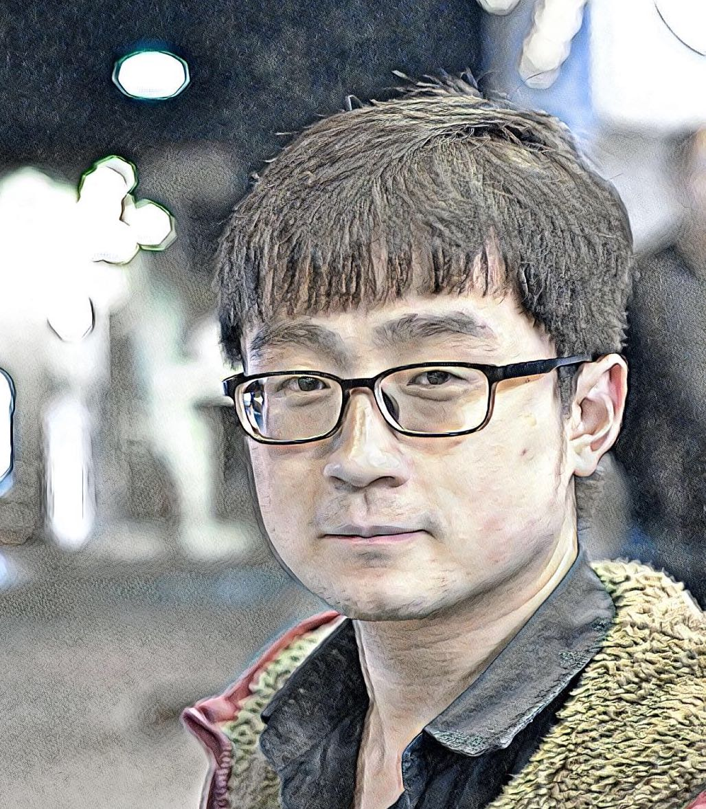

[Media Analysis and Computing Lab (MAC)](http://mac.xmu.edu.cn/index.php).

[Xiamen University](http://www.xmu.edu.cn/), China.

Email: lynnliu.xmu[AT]gmail.com **or** lynnliu0207[AT]163.com              

[[Goolge Scholar](https://scholar.google.com/citations?user=BC7N2dYAAAAJ&hl=zh-CN)] [[Goolge's Website](https://sites.google.com/site/hlxmu27)]

## About Me

I am currently a second year Ph.D student in computer science at [Xiamen University](http://www.xmu.edu.cn/), under by [Prof. Rongrong Ji](http://mac.xmu.edu.cn/rrji-en.html). 

My research interests are in computer vision and machine learning, especially in hashing-accelerated machine learning, Riemannian-based machine learning, and adversarial deep learning.

## Publications

### Pre-print:
1. Xiao Liu, Shengchuan Zhang, **Hong Liu**, Xin Liu, Cheng Deng, Rongrong Ji. [CerfGAN: A Compact, Effective, Robust, and Fast Model for Unsupervised Multi-Domain Image-to-Image Translation](https://arxiv.org/abs/1805.10871). In Arxiv, 2018
2. Jie Li, Rongrong Ji, **Hong Liu**, Xiaopeng Hong, Yue Gao, Qi Tian. [Universal Perturbation Attack Against Image Retrieval](https://arxiv.org/abs/1812.00552). In Arxiv, 2018

### Journal:
1. **Hong Liu**, Rongrong Ji, Jingdong Wang, and Chunhua Shen. [Ordinal Constraint Binary Coding for Approximate Nearest Neighbor Search](http://ieeexplore.ieee.org/document/8326558/). IEEE Trans. on Pattern Analysis and Machine Intelligence. Volume: 41, Issue: 4, 2019. 
2. Rongrong Ji; **Hong Liu**; Liujuan Cao; Di Liu; Yongjian Wu, and Feiyue Huang. [Towards Optimal Manifold Hashing via Discrete Locally Linear Embedding](http://ieeexplore.ieee.org/abstract/document/8000395/), IEEE Trans. on Image Processing, Volume 26, Issue 11, 2017. [[MATLAB CODES](https://github.com/LynnHongLiu/DLLH)]
3. **Hong Liu**, Aiwen Jiang, Mingwen Wang and Jianyi Wan.[Local Similarity Preserved Hashing Learning via Markov Graph for Efficient Similarity Search.](http://www.sciencedirect.com/science/article/pii/S0925231215001538) Neurocomputing, 159, 2015.

### Conference:
1. Jie Hu, Rongrong Ji, **Hong Liu**, Shengchuan Zhang, Cheng Deng, Qi Tian. [Towards Visual Feature Translation](https://arxiv.org/abs/1812.00573). CVPR, 2019.
2. **Hong Liu**, Jie Li, Rongrong Ji, and Yongjian Wu. [Learning Neural Bag-of-Matrix-Summarization with Riemannian Network](http://mac.xmu.edu.cn/rrji/papers/aaai-2019_liuhong.pdf). AAAI, 2019. 
3. Mingbao Lin, Rongrong Ji, **Hong Liu**, Xiaoshuai Sun, Yongjian Wu, and Yunsheng Wu. [Towards Optimal Discrete Online Hashing with Balanced Similarity](http://mac.xmu.edu.cn/rrji/papers/Towards%20Optimal%20Discrete%20Online%20Hashing%20with%20Balanced%20Similarity.pdf). AAAI, 2019.
4. **Hong Liu**, Mingbao Lin, Shengchuan Zhang, Yongjian Wu, Feiyue Huang, and Rongrong Ji. [Dense Auto-Encoder Hashing for Robust Cross-Modality Retrieval](https://dl.acm.org/citation.cfm?id=3240684). ACM MM, 2018. 
5. Mingbao Lin, Rongrong Ji, **Hong Liu**, and Yongjian Wu. [Supervised Online Hashing via Hadamard Codebook Learning](https://dl.acm.org/citation.cfm?id=3240519). ACM MM, 2018. (Oral) [[MATALB CODES](https://github.com/lmbxmu/Supervised-Online-Hashing-via-Hadamard-Codebook-Learning)]
6. Jianqiang Qian, Xianmin Lin, **Hong Liu**, Youming Deng, and  Rongrong Ji. [Towards Compact Visual Descriptor via Deep Fisher Network with Binary Embedding](https://lynnhongliu.github.io/hliu/icme18.pdf). ICME, 2018. (Oral) 
7. **Hong Liu**; Rongrong Ji; Yongjian Wu; Feiyue Huang; Baochang Zhang. [Cross-Modality Binary Code Learning via Fusion Similarity Hashing](http://mac.xmu.edu.cn/pdf/3667.pdf). CVPR, 2017. [[MATLAB CODES](https://github.com/LynnHongLiu/FSH)]
8. **Hong Liu**; Rongrong Ji; Yongjian Wu; Feiyue Huang. [Ordinal Constrained Binary Code Learning for Nearest Neighbor Search](https://aaai.org/ocs/index.php/AAAI/AAAI17/paper/view/14813/14399). AAAI, 2017. (Oral) [[MATLAB CODES](https://github.com/LynnHongLiu/OCH)]
9. **Hong Liu**; Rongrong Ji; Yongjian Wu; Gang Hua. [Supervised Matrix Factorization for Cross-Modality Hashing](http://www.ijcai.org/Proceedings/16/Papers/253.pdf). IJCAI, 2016. [[MATALB CODES](https://github.com/LynnHongLiu/SMFH)] [[STATEMENT](http://mac.xmu.edu.cn/pdf/RPub.pdf)]
10.  **Hong Liu**; Rongrong Ji; Yongjian Wu; Wei Liu. [Towards Optimal Binary Code Learning via Ordinal Embedding. ](http://www.ee.columbia.edu/~wliu/AAAI16_OrdinalEmbed.pdf)AAAI, 2016. [[MATLAB CODES](https://github.com/LynnHongLiu/OEH)]

## Working Experiences

- 2015.07 - 2015.09, Research Intern, [Tencent Youtu Lab](https://bestimage.qq.com/).

## Activities

**Reviewer**: IEEE TIP, IEEE TKDE, PR, PRL, Neurocomputing, TVCJ, PLOS ONE.

**PC Member**: ICMR, IEEE-ICBK.

## Awards

* **National Scholarships, 2017.**

* **Highlights in MIREX 2015 Query-by-Humming, 2015.**  ([Link](http://www.music-ir.org/mirex/wiki/2015:MIREX2015_Results))

## Contact

**Institution**: School of Information Science and Engineering, Xiamen University, China

**Address**: Room 701, Administration Building #B, Haiyun Park, Xiamen University, 361005

**E-mail**:  lynnliu.xmu[AT]gmail.com or lynnliu0207[AT]163.com or lynnliu[AT]stu.xmu.edu.cn

## Friends

[Zhun Zhong](http://zhunzhong.site/) Xiamen University & University of Technology Sydney

[Zhiming Luo](https://sites.google.com/view/zhimingluo) Xiamen University 

[Mingbao Lin](https://lmbxmu.github.io/) Xiamen University 

[Qingyuan Jiang](http://lamda.nju.edu.cn/jiangqy/) Nanjing University

[Shengchuan Zhang](https://scholar.google.com/citations?user=GToqXScAAAAJ&hl=en) Xiamen University

[Jie Gui](https://scholar.google.com/citations?hl=en&user=f8oE8NgAAAAJ&view_op=list_works&sortby=pubdate) Chinese Academy of Sciences
   
---

